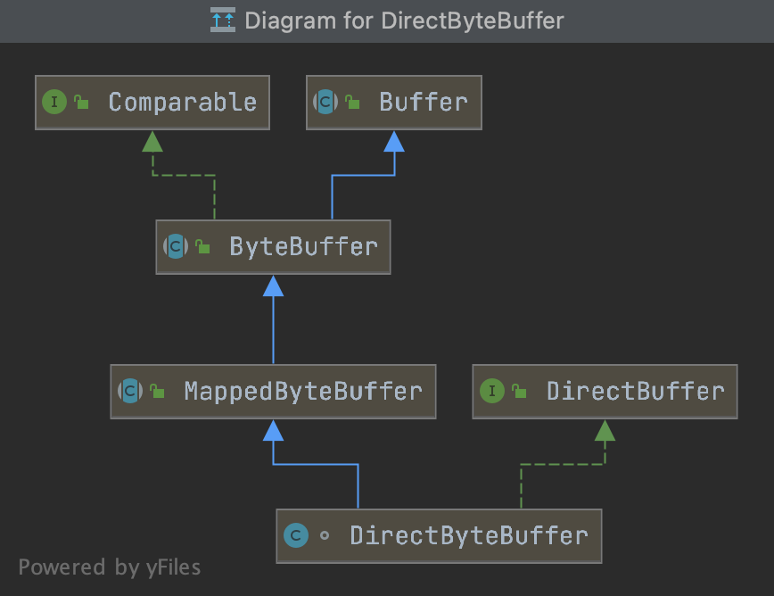

```java
Java对于MMAP或者叫零拷贝的API

当DirectByteBuffer不再被使用时,会触发内部cleaner的钩子,保险起见可以考虑手动回收:((DirectBuffer) buffer).cleaner().clean();
```

---

```java
File file = new File("test.txt");
FileChannel channel = new RandomAccessFile(file, "rw").getChannel();
//MappedByteBuffer实现类是DirectByteBuffer
//DirectByteBuffer使用的是堆外内存
MappedByteBuffer mappedByteBuffer = channel.map(FileChannel.MapMode.READ_WRITE, 0, 1000);
for (int i = 0; i < 1000; i++){
  mappedByteBuffer.put((byte)i);
}
mappedByteBuffer.position(0);
for (int i = 0; i < 1000; i++){
  mappedByteBuffer.get();
}
```



---

### 源码解析

#### 1.FileChannelImpl#map

```java
public MappedByteBuffer map(MapMode mode, long position, long size) {
  try {
    //native函数map0完成MMAP
    addr = map0(imode, mapPosition, mapSize); //2
  } catch (OutOfMemoryError x) {
    //如果抛出异常,执行一次GC
    System.gc();
    try {
      //睡眠一下,让GC线程执行完成
      Thread.sleep(100);
    } catch (InterruptedException y) {
      Thread.currentThread().interrupt();
    }
    try {
      //在执行一次MMAP
      addr = map0(imode, mapPosition, mapSize);
    } catch (OutOfMemoryError y) {
      //如果再次抛出异常,就表示MMAP映射失败
      throw new IOException("Map failed", y);
    }
  }
  
  else {
    //DirectByteBuffer实例
    return Util.newMappedByteBuffer(isize,
                                    addr + pagePosition,
                                    mfd,
                                    um); //3
  }
}
```

#### 2.map0

```java
private native long map0(int prot, long position, long length) throws IOException;
↓
↓
JNIEXPORT jlong JNICALL
Java_sun_nio_ch_FileChannelImpl_map0(JNIEnv *env, jobject this,
                                     jint prot, jlong off, jlong len)
{
    void *mapAddress = 0;
    jobject fdo = (*env)->GetObjectField(env, this, chan_fd);
    jint fd = fdval(env, fdo);
    int protections = 0;
    int flags = 0;

  	//PROT_READ:页内容可以被读取
		//PROT_WRITE:页内容可以被写入
  	//MAP_SHARED:允许其他映射该文件的进程共享.直到msync()或者munmap()被调用,文件实际上不会被更新.
    if (prot == sun_nio_ch_FileChannelImpl_MAP_RO) {
        protections = PROT_READ;
        flags = MAP_SHARED;
    } else if (prot == sun_nio_ch_FileChannelImpl_MAP_RW) {
        protections = PROT_WRITE | PROT_READ;
        flags = MAP_SHARED;
    } else if (prot == sun_nio_ch_FileChannelImpl_MAP_PV) {
        protections =  PROT_WRITE | PROT_READ;
        flags = MAP_PRIVATE;
    }

    mapAddress = mmap64(
      	//让操作系统决定起始位置
        0,                    /* Let OS decide location */
      	//映射长度
        len,                  /* Number of bytes to map */
        protections,          /* File permissions */
        flags,                /* Changes are shared */
        fd,                   /* File descriptor of mapped file */
        off);                 /* Offset into file */

    if (mapAddress == MAP_FAILED) {
        if (errno == ENOMEM) {
            JNU_ThrowOutOfMemoryError(env, "Map failed");
            return IOS_THROWN;
        }
        return handle(env, -1, "Map failed");
    }

    return ((jlong) (unsigned long) mapAddress);
}
```

#### 3.Util#newMappedByteBuffer

```java
static MappedByteBuffer newMappedByteBuffer(int size, long addr,
                                            FileDescriptor fd,
                                            Runnable unmapper) {
  MappedByteBuffer dbb;
  if (directByteBufferConstructor == null)
    initDBBConstructor();
  try {
    //利用java.nio.DirectByteBuffer的构造函数初始化
    dbb = (MappedByteBuffer)directByteBufferConstructor.newInstance(
      new Object[] {new Integer(size),
                    new Long(addr),
                    fd,
                    unmapper });
  }
  return dbb;
}
```

#### 4.DirectByteBuffer的构造方法

```java
DirectByteBuffer(int cap) {
  //Cleaner对象继承自PhantomReference,是一个虚引用
  cleaner = Cleaner.create(this, new Deallocator(base, size, cap));
}

```

---

