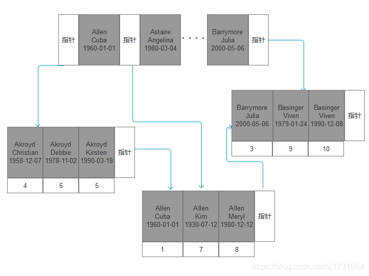

#### BTree

```
17,35表示主键id
P1,P2表示磁盘块地址
data表示数据
```


**查找主键id等于28的data过程**

```
1.磁盘块1,读入内存
2.比较28,发现28可能在P2指向的地址内
3.根据P2找到磁盘块3,读入内存
4.比较28,发现28可能在P2指向的地址内
5.根据P2找到磁盘块8,读入内存
6.找到data
```

**BTree有什么缺点?**

```
每个节点都会存储主键和data,如果data较大,将会导致每个节点存储的key数量变少
当数据量很大时会导致树的深度较深,这样会大大增加磁盘I/O次数
```


---

#### B+Tree

```
非叶子节点存储主键id和磁盘块地址
叶子节点存储主键id和数据
```


**为什么不使用BTree,而使用B+Tree做为InnoDB的索引?**

```
在B+Tree中包含数据的节点都是在同一层的叶子节点上,非叶子节点上只存储主键id和磁盘块地址
这样会增加非叶子节点存储主键id的数量,降低整个树的深度,从而减少磁盘I/O次数
```

**使用InnoDB存储引擎,表中使用主键类型为INT,则非叶子节点可以存储多少条主键?**

```
InnoDB存储引擎是以页为单位,默认是16KB(show variables like 'innodb_page_size')
INT类型占用空间为4B,指针占用空间为4B,非叶子节点最大可以存储16KB/(4B+4B),约等于2千个
```


---

#### 聚集索引(聚簇索引)

```
聚集索引的叶子节点存放主键id和数据
```

#### 辅助索引(非聚簇索引)

```
辅助索引的叶子节点存放索引的字段和主键id
通过辅助索引查询数据时,先找到辅助索引中对应的主键id,再通过主键id在聚集索引中找到数据
```

---

### 存储引擎

#### InnoDB

```
至少有一个聚集索引,聚集索引的叶子节点存储数据,辅助索引的叶子节点存储主键id
```

#### MyISAM

```
聚集索引和辅助索引的叶子节点存储数据的地址
```

---


#### 回表查询

```
先通过辅助索引查找到聚集索引的值,再通过聚集索引的值找到数据,这个过程需要扫描两次B+Tree
```

#### 索引覆盖

```
只需要在一颗索引树上就能获取SQL所需要的列,无需回表,速度更快
```

```sql
-- 在字段age上建立辅助索引

-- 下面的SQL只需要在一颗索引树上就可以得到结果,无需回表查询
select id,age from user where age=10;

-- 下面的SQL则会进行回表查询
-- 因为name列不在age的索引树上,所以需要先通过age索引树查询到主键id,再通过聚集索引查询数据
select id,age,name from user where age = 10;
```

---


#### 多列索引对应的b+tree结构

我们对firstName,lastName,birthday这三列建立一个复合索引,即key(firstName,lastName,birthday)


```
索引结构中的数据都是按照顺序排列的,索引首先会按照firstName排序即按照字母顺序排列,firstName相同的情况下按照lastName排序,lastName相同的情况下再按照birthday排序

key值左边的指针指向了小于key值得节点
key值右边的指针指向大于等于key值的节点
```


