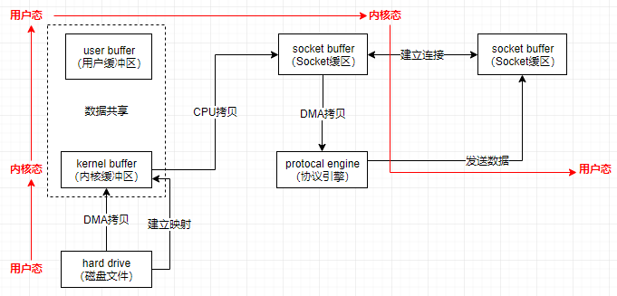

#### DMA

```
Direct Memory Access,直接内存存取
CPU老哥太累了,所以找了个小弟,就是DMA替他完成一部分工作,这样CPU就能去做其他事情了
```

#### 内核态和用户态

```
女同学想让你修个电脑,但是宿管阿姨不放你进女生宿舍,这个时候你就是用户态
你不能进女生宿舍,所以你只能让宿管阿姨来帮你把电脑取出来,这个时候宿管阿姨内核态
```

#### 内存

```
内存存储单元是一个字节
内存地址(Memory Address)属于线程地址,使用十六进制表示内存地址,比如0x1A010CB0
内存地址的上限与计算机的位数有关,例如32位机器地址范围位0x00000000 到0xFFFFFFFF
内存读取属于随机读取(Random Access Memoery),也就是读取时间于数据所在位置无关
```

#### 虚拟内存地址

```
进程是不能直接读写内存地址,进程只能通过虚拟内存地址来进行读写内存地址
操作系统会把虚拟内存地址翻译成相应的内存地址
```

#### 内存分页

```
Linux把内存分割成页来管理,每页可以存放4096个字节,4KB
这样做可以减少虚拟内存地址与内存地址的映射关系的存储
```

#### 页缓存(Page Cache)

```
文件存放在硬盘中,CPU并不能直接访问硬盘中的数据,而是需要先将硬盘中的数据读入到内存中,然后才能被CPU访问.读写硬盘的速度比读写内存要慢很多,所以为了避免每次读写文件时,都需要对硬盘进行读写操作,Linux使用页缓存(Page Cache)机制来对文件中的数据进行缓存

当从文件中读取数据时,如果要读取的数据所在的页缓存已经存在,那么就直接把页缓存的数据拷贝给用户.
否则内核申请一个空闲的内存页(页缓存),从文件中读取数据到页缓存,然后把页缓存的数据拷贝给用户.

当向文件中写入数据时,如果要写入的数据所在的页缓存已经存在,那么直接把新数据写入到页缓存即可.否则内核申请一个空闲的内存页(页缓存),从文件中读取数据到页缓存,并且把新数据写入到页缓存中.对于被修改的页缓存,内核会定时把这些页缓存刷新到文件中.

预读机制,顺序读的速度快于随机读,顺序写的速度快于随机写
```

#### 零拷贝(mmap和sendFile)

```
所谓零拷贝,就是用户态与内核态的数据拷贝的次数为零.省去从内核态复制到用户态的过程.
```

**传统IO**

```
4次上下文切换(用户态 -> 内核态 -> 用户态 -> 内核态 -> 用户态)
4次拷贝
1.磁盘文件 DMA拷贝 到内核缓冲区
2.内核缓冲区 CPU拷贝 到用户缓冲区
3.用户缓冲区 CPU拷贝 到Socket缓冲区
4.Socket缓冲区 DMA拷贝 到协议引擎
```


**mmap**

```
mmap将磁盘文件映射到内存,支持读和写,对内存的操作会反映在磁盘文件上,适合小数据量读写

4次上下文切换(用户态 -> 内核态 -> 用户态 -> 内核态 -> 用户态)
3次拷贝
1.磁盘文件 DMA拷贝 到内核缓冲区
2.内核缓冲区 CPU拷贝 到Socket缓冲区
3.Socket缓冲区 DMA拷贝 到协议引擎
```



**sendFile**

```
sendfile适合大文件传输

2次上下文切换(用户态 -> 内核态 -> 用户态)
2次拷贝
1.磁盘文件 DMA拷贝 到内核缓冲区
2.内核缓冲区 DMA拷贝 到协议引擎
```

