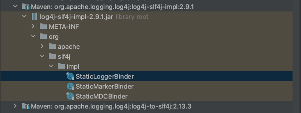

#### Maven

```xml
<parent>
		<groupId>org.springframework.boot</groupId>
		<artifactId>spring-boot-starter-parent</artifactId>
		<version>2.4.12</version>
		<relativePath/> <!-- lookup parent from repository -->
</parent>
<dependencies>
		<dependency>
        <!-- 传递依赖logback-classic -->
				<dependency>
            <groupId>org.springframework.boot</groupId>
            <artifactId>spring-boot-starter-web</artifactId>
        </dependency>
      	<!-- 添加依赖log4j-slf4j-impl为了测试 -->
				<dependency>
            <groupId>org.apache.logging.log4j</groupId>
            <artifactId>log4j-slf4j-impl</artifactId>
            <version>2.9.1</version>
        </dependency>
	  </dependency>
</dependencies>
```

---

### SpringBoot过程

**下面源码解析在spring-jcl-5.3.12.jar包中**

#### 1.SpringApplication

```java
public class SpringApplication {
	private static final Log logger = LogFactory.getLog(SpringApplication.class);
}
```

#### 2.LogFactory#getLog

```java
public static Log getLog(Class<?> clazz) {
	return getLog(clazz.getName());
}
↓
↓
public static Log getLog(String name) {
	return LogAdapter.createLog(name);
}
```

#### 3.LogAdapter#createLog

**spring-jcl-5.3.12.jar中**

```java
public static Log createLog(String name) {
  //根据logApi的值选择初始化对应Log
  switch (logApi) {
    case LOG4J:
      return Log4jAdapter.createLog(name);
    case SLF4J_LAL:
      //SLF4J新版本(大于1.3版本)举例
      return Slf4jAdapter.createLocationAwareLog(name);
    case SLF4J:
      return Slf4jAdapter.createLog(name);
    default:
      return JavaUtilAdapter.createLog(name);
  }
}
↓
↓
//LogAdapter的static静态初始化块
static {
  if (isPresent("org.apache.logging.log4j.spi.ExtendedLogger")) {
    if (isPresent("org.apache.logging.slf4j.SLF4JProvider") 
        && isPresent("org.slf4j.spi.LocationAwareLogger")) {
      logApi = LogApi.SLF4J_LAL; //slf4j新版本
    }
    else {
      logApi = LogApi.LOG4J; //log4j2.x
    }
  }
  else if (isPresent("org.slf4j.spi.LocationAwareLogger")) {
    logApi = LogApi.SLF4J_LAL; //slf4j新版本
  }
  else if (isPresent("org.slf4j.Logger")) {
    logApi = LogApi.SLF4J; //slf4j老版本
  }
  else {
    logApi = LogApi.JUL;
  }
}
```

| jar            | 类                                          | 版本                |
| -------------- | ------------------------------------------- | ------------------- |
| log4j-api      | org.apache.logging.log4j.spi.ExtendedLogger | log4j2.x版本        |
| log4j-to-slf4j | org.apache.logging.slf4j.SLF4JProvider      | log4j2.x的SLF4J桥接 |
| slf4j-api      | org.slf4j.spi.LocationAwareLogger           | SLF4J >= 1.3        |
| slf4j-api      | org.slf4j.Logger                            | SLF4J < 1.3         |

#### 4.Slf4jAdapter#createLocationAwareLog

```java
public static Log createLocationAwareLog(String name) {
  //下面进入SLF4J的过程
  Logger logger = LoggerFactory.getLogger(name);
  return (logger instanceof LocationAwareLogger ? 
          new Slf4jLocationAwareLog((LocationAwareLogger) logger) :
          new Slf4jLog<>(logger));
}
```

---

### SLF4J的过程

**下面的源码解析在slf4j-api-1.7.32.jar包中**

#### 1.LoggerFactory#getLogger

```java
public static Logger getLogger(String name) {
  ILoggerFactory iLoggerFactory = getILoggerFactory();
  return iLoggerFactory.getLogger(name); //Logback的过程第4步
}
↓
↓
public static ILoggerFactory getILoggerFactory() {
  if (INITIALIZATION_STATE == UNINITIALIZED) {
    synchronized (LoggerFactory.class) {
      if (INITIALIZATION_STATE == UNINITIALIZED) {
        INITIALIZATION_STATE = ONGOING_INITIALIZATION;
        performInitialization();
      }
    }
  }
  switch (INITIALIZATION_STATE) {
    case SUCCESSFUL_INITIALIZATION:
      //返回LoggerFactory
      return StaticLoggerBinder.getSingleton().getLoggerFactory();
  }   
}
↓
↓
private final static void performInitialization() {
  	//绑定
  	bind();
}
↓
↓
private final static void bind() {
		try {
    		Set<URL> staticLoggerBinderPathSet = null;
      	if (!isAndroid()) {
          	//查找classpath下的所有org.slf4j.impl.StaticLoggerBinder类
        		staticLoggerBinderPathSet = findPossibleStaticLoggerBinderPathSet(); //2
          	//如果存在多个,打印警告日志
          	reportMultipleBindingAmbiguity(staticLoggerBinderPathSet); //3
        }
      	//每个日志实现都会有org.slf4j.impl.StaticLoggerBinder类,这里会随机加载其中一个
      	//下面进入Logback的过程
      	StaticLoggerBinder.getSingleton();
	      INITIALIZATION_STATE = SUCCESSFUL_INITIALIZATION;
    }
}
```

#### 2.LoggerFactory#findPossibleStaticLoggerBinderPathSet

```java
static Set<URL> findPossibleStaticLoggerBinderPathSet() {
  Set<URL> staticLoggerBinderPathSet = new LinkedHashSet<URL>();
  try {
    ClassLoader loggerFactoryClassLoader = LoggerFactory.class.getClassLoader();
    Enumeration<URL> paths;
    else {
      //查找classpath下的所有org.slf4j.impl.StaticLoggerBinder类
      paths = loggerFactoryClassLoader.getResources("org/slf4j/impl/StaticLoggerBinder.class");
    }
    //循环遍历
    while (paths.hasMoreElements()) {
      URL path = paths.nextElement();
      //添加到staticLoggerBinderPathSet集合中
      staticLoggerBinderPathSet.add(path);
    }
  }
  return staticLoggerBinderPathSet;
}
```

#### 3.LoggerFactory#reportMultipleBindingAmbiguity

```java
private static void reportMultipleBindingAmbiguity(Set<URL> binderPathSet) {
  	//如果存在多个绑定,打印如下错误信息
  	if (isAmbiguousStaticLoggerBinderPathSet(binderPathSet)) {
        Util.report("Class path contains multiple SLF4J bindings.");
        for (URL path : binderPathSet) {
            Util.report("Found binding in [" + path + "]");
        }
        Util.report("See " + MULTIPLE_BINDINGS_URL + " for an explanation.");
    }
}
```

**如果存在多个StaticLoggerBinder,控制台就会抛出如下常见警告**


#### logback


#### log4j2



---

### Logback的过程

**下面的源码解析在logback-classic-1.2.6.jar包中**

#### 1.StaticLoggerBinder#getSingleton

```java
public static StaticLoggerBinder getSingleton() {
  return SINGLETON;
}
↓
↓
private static StaticLoggerBinder SINGLETON = new StaticLoggerBinder();
static {
	SINGLETON.init();
}
↓
↓
void init() {
	new ContextInitializer(defaultLoggerContext).autoConfig(); 
}
```

#### 2.ContextInitializer#autoConfig

```java
public void autoConfig() throws JoranException {
  //查找配置文件
	URL url = findURLOfDefaultConfigurationFile(true); //3
  if (url != null) {
    //如果找到配置文件,则根据配置文件去配置
    configureByResource(url);
  } else {
		...
  	else {
      //如果没有配置文件,则初始化一个默认配置
      BasicConfigurator basicConfigurator = new BasicConfigurator();
      basicConfigurator.setContext(loggerContext);
      basicConfigurator.configure(loggerContext);
    }
  }
}
```

#### 3.ContextInitializer#findURLOfDefaultConfigurationFile

```java
public URL findURLOfDefaultConfigurationFile(boolean updateStatus) {
  ClassLoader myClassLoader = Loader.getClassLoaderOfObject(this);
  URL url = findConfigFileURLFromSystemProperties(myClassLoader, updateStatus);
  if (url != null) {
    return url;
  }
  url = getResource("logback-test.xml", myClassLoader, updateStatus);
  if (url != null) {
    return url;
  }
  url = getResource("logback.groovy", myClassLoader, updateStatus);
  if (url != null) {
    return url;
  }
  return getResource("logback.xml", myClassLoader, updateStatus);
}
```

#### 4.LoggerContext#getLogger

**LoggerContext就是ILoggerFactory的实现类**

```java
public final Logger getLogger(final String name) {
  //获取root Logger
	if (Logger.ROOT_LOGGER_NAME.equalsIgnoreCase(name)) {
		return root;
  }
  //从缓存中获取
  Logger childLogger = (Logger) loggerCache.get(name);
  if (childLogger != null) {
    return childLogger;
  }
}
```

---
